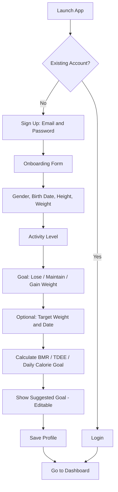
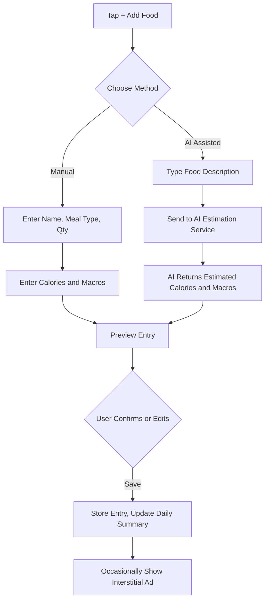
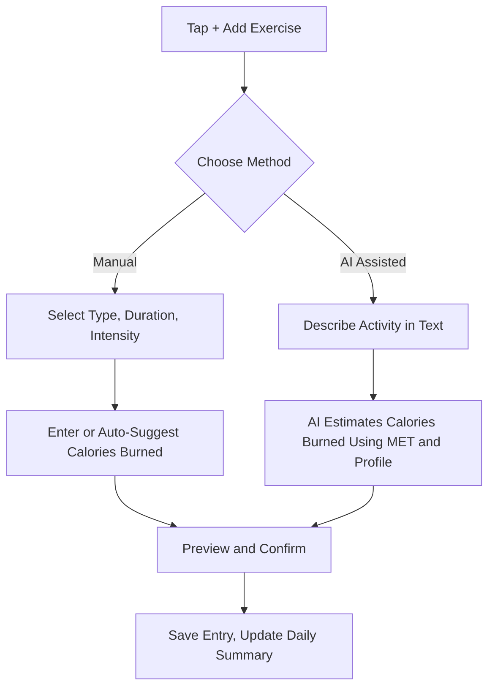
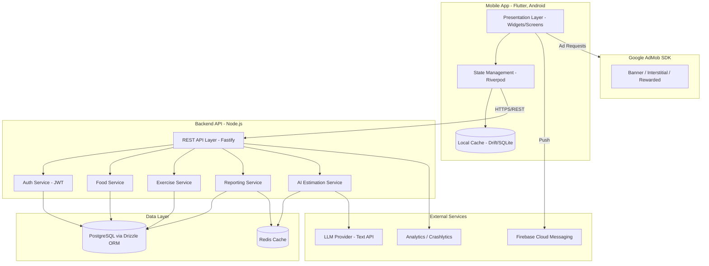
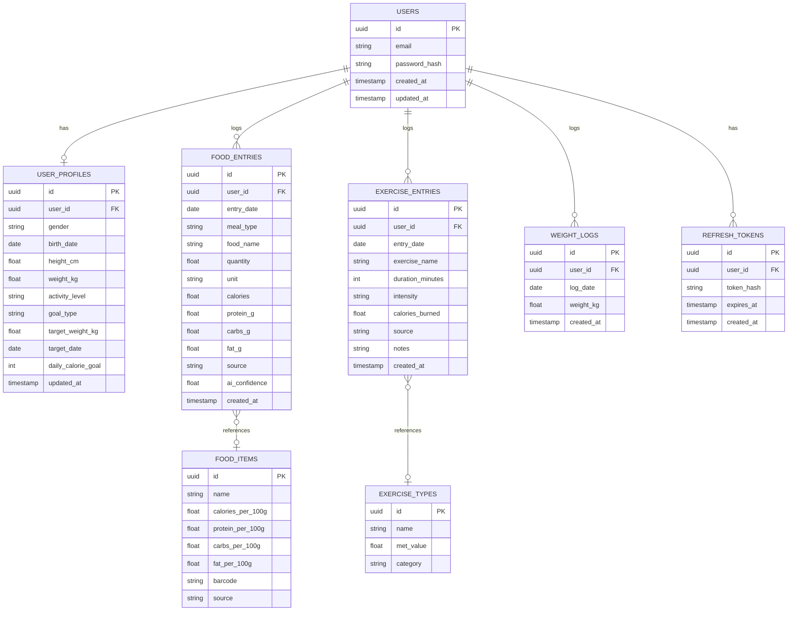

# Product Requirements Document

## CalTrack — Calorie & Exercise Tracker (Android)

|                  |                                                        |
| ---------------- | ------------------------------------------------------ |
| **Status**       | Draft v1.0                                             |
| **Platform**     | Android (Flutter — architected to extend to iOS later) |
| **Backend**      | Node.js (separate service)                             |
| **Monetization** | In-app advertising                                     |
| **Date**         | July 2026                                              |

> **Note on naming:** "CalTrack" is a placeholder working title used throughout this document — swap in the real app name before development/Play Store submission.

---

## 1. Overview

### 1.1 Product Summary

CalTrack is a mobile app for tracking daily caloric intake (food) and caloric expenditure (exercise/workouts). Users set a personal goal during onboarding (lose, maintain, or gain weight) based on their body stats, then log food and exercise throughout the day either **manually** or via an **AI agent** that estimates calories from a short text description. The app visualizes intake vs. outtake across daily, weekly, monthly, and custom date ranges.

### 1.2 Problem Statement

Most calorie trackers require slow, manual entry from massive food databases, which causes users to abandon logging within days. CalTrack lowers that friction by letting users describe what they ate/did in plain language and have AI estimate the calories, while still supporting fast manual entry for power users who know their numbers.

### 1.3 Target Users

- Health-conscious individuals tracking weight loss, maintenance, or muscle gain
- Casual users who want a low-friction way to log meals and workouts
- Users who prefer speaking/typing naturally ("2 fried eggs and toast") over browsing food databases

### 1.4 Business Model

- **Free app, ad-supported** via Google AdMob (banner + interstitial + optional rewarded ads).
- AI-estimation calls are the primary cost driver, so they are natively tied to the monetization loop (e.g., rewarded ads can unlock extra AI estimates per day) — see §3.6 and §7.4.
- Not required for v1, but the architecture should not preclude a future premium/no-ads tier.

### 1.5 Goals & Success Metrics

| Metric                                    | Target (post-launch)                                         |
| ----------------------------------------- | ------------------------------------------------------------ |
| D1 / D7 / D30 retention                   | Track and optimize; benchmark against habit-tracker category |
| Avg. entries logged per active user/day   | ≥ 2 (indicates habitual logging)                             |
| AI vs. manual entry ratio                 | Track to gauge AI feature value and cost                     |
| Ad revenue per daily active user (ARPDAU) | Track post-launch, tune ad frequency against retention       |
| Crash-free session rate                   | ≥ 99.5%                                                      |

### 1.6 Platform Scope (v1)

- **Android only**, distributed via Google Play Store.
- Built in Flutter so iOS can be added later with minimal rework.
- Internet required for AI estimation, sync, and ads; basic logging should degrade gracefully offline (see NFR-2).

---

## 2. Requirements

### 2.1 Functional Requirements

| ID    | Area             | Requirement                                                                                                                                                            | Priority   |
| ----- | ---------------- | ---------------------------------------------------------------------------------------------------------------------------------------------------------------------- | ---------- |
| FR-1  | Auth             | User can register/login via email + password only (no email verification required in v1)                                                                               | Must       |
| FR-2  | Onboarding       | User completes a required profile form: gender, birth date, height, weight, activity level, goal type, optional target weight/date                                     | Must       |
| FR-3  | Onboarding       | System calculates BMR/TDEE and a suggested daily calorie goal (editable by user)                                                                                       | Must       |
| FR-4  | Food logging     | User can manually add a food entry: name, meal type, quantity/unit, calories, and optional macros                                                                      | Must       |
| FR-5  | Food logging     | User can add a food entry via AI: type a text description (e.g., "2 fried eggs and toast"), AI returns estimated calories/macros for review before saving              | Must       |
| FR-6  | Exercise logging | User can manually add an exercise entry: type, duration, intensity, calories burned                                                                                    | Must       |
| FR-7  | Exercise logging | User can add an exercise entry via AI: describe the activity, AI estimates calories burned using user's body stats + MET values                                        | Must       |
| FR-8  | Dashboard        | User sees daily summary: calories in, calories out, net, remaining vs. goal, macro breakdown                                                                           | Must       |
| FR-9  | Reports          | User can view weekly, monthly, and custom date-range summaries with trend charts                                                                                       | Must       |
| FR-10 | Entries          | User can edit or delete any past food/exercise entry                                                                                                                   | Must       |
| FR-11 | Weight tracking  | User can log body weight over time and see a trend line toward their target                                                                                            | Should     |
| FR-12 | Notifications    | Push reminders for logging meals / weigh-ins (configurable)                                                                                                            | Should     |
| FR-13 | Monetization     | Banner ads on list/dashboard screens; interstitial ads at natural breakpoints (e.g., every N entries); optional rewarded ad to unlock extra AI estimations for the day | Must       |
| FR-14 | Settings         | User can edit profile, goals, units (metric/imperial), notification preferences; delete account/data                                                                   | Must       |
| FR-15 | Data export      | User can export their history as CSV                                                                                                                                   | Could      |
| FR-16 | Barcode scan     | Scan packaged food barcode to prefill nutrition info                                                                                                                   | Could (v2) |

### 2.2 Non-Functional Requirements

| ID    | Category              | Requirement                                                                                                                                                                                                     |
| ----- | --------------------- | --------------------------------------------------------------------------------------------------------------------------------------------------------------------------------------------------------------- |
| NFR-1 | Performance           | Dashboard and history screens load in ≤ 2s on a typical mid-range Android device with a normal connection                                                                                                       |
| NFR-2 | Offline support       | Manual entries can be created offline and cached locally, then synced when connectivity returns; AI estimation requires connectivity                                                                            |
| NFR-3 | Security              | Passwords hashed (bcrypt/argon2); all traffic over HTTPS/TLS; JWT access + refresh token auth                                                                                                                   |
| NFR-4 | Privacy               | Health/body data is sensitive — support account deletion with full data purge; publish a privacy policy (required for Play Store health-adjacent apps)                                                          |
| NFR-5 | Scalability           | Backend stateless and horizontally scalable; DB indexed for per-user date-range queries                                                                                                                         |
| NFR-6 | Cost control          | AI calls are rate-limited per user/day; responses cached where inputs repeat; monitor per-request LLM cost                                                                                                      |
| NFR-7 | Play Store compliance | Adheres to Google Play's Ads policy, Health Content policy, and Families policy (if applicable); AdMob implementation follows Google's ad placement policies (no accidental clicks, no ads over active content) |
| NFR-8 | Accessibility         | Support Android system font scaling and adequate color contrast for charts/text                                                                                                                                 |

---

## 3. Core Features

### 3.1 Onboarding & Profile Setup

Mandatory first-run flow collecting: gender, birth date, height, weight, activity level (sedentary → very active), goal (lose / maintain / gain weight), and optionally target weight + target date. Produces a computed, user-editable daily calorie goal.

### 3.2 Food Logging (Manual + AI)

Add entries by meal (breakfast/lunch/dinner/snack). Manual path: type name, quantity, and calories/macros directly. AI path: describe the meal in natural language (text only); the AI agent returns a structured, editable estimate (food name, calories, protein/carbs/fat) that the user confirms before saving.

### 3.3 Exercise / Workout Logging (Manual + AI)

Log workouts by type, duration, and intensity. Manual path: user enters calories burned directly (or the app estimates via MET tables + user weight). AI path: user describes the activity ("ran 5k in 30 minutes"); AI returns an estimated calorie burn using MET-based reasoning combined with the user's profile.

### 3.4 Dashboard & Reporting

- **Daily view**: intake vs. outtake vs. goal, remaining calories, macro rings.
- **Weekly / Monthly view**: trend charts (bar/line) of net calories, adherence to goal, weight trend overlay.
- **Custom range**: user-selected start/end date for the same breakdown.

### 3.5 Weight Tracking

Lightweight body-weight log with a trend chart toward the user's target, decoupled from daily food/exercise entries.

### 3.6 AI Agent Integration

A backend service that wraps a text LLM to turn unstructured input (a free-text description) into structured nutrition/exercise data. Always presented to the user as an **editable suggestion**, never auto-saved silently — this both improves accuracy over time and limits liability for wrong estimates.

### 3.7 Notifications

Configurable reminders (e.g., "Log your lunch", "Log today's weight") via push notifications.

### 3.8 Monetization (Ads)

- Banner ads: dashboard and history/report screens.
- Interstitial ads: shown at natural breakpoints (e.g., after saving an entry, capped in frequency) — never mid-form.
- Rewarded ads (optional, ties into cost control): watch an ad to unlock additional AI estimations beyond the daily free quota.

### 3.9 Account & Settings

Edit profile/goals, switch units, manage notifications, log out, delete account and all associated data.

---

## 4. User Flows

### 4.1 Onboarding Flow

### 4.2 Add Food Entry Flow

### 4.3 Add Exercise Entry Flow

### 4.4 Dashboard / Reports Flow

1. User opens app → lands on **Daily Dashboard** (today's intake, outtake, net, remaining calories, macro breakdown, banner ad).
2. User taps **Weekly / Monthly / Custom** tab → selects range (or picks custom start/end dates) → sees trend chart + summary totals for that range.
3. User taps into any day from a chart → drills into that day's individual entries.

### 4.5 Edit / Delete Entry Flow

1. User opens **History** or drills in from the dashboard.
2. Taps an entry → sees details → chooses **Edit** (form pre-filled, same validation as creation) or **Delete** (confirmation prompt).
3. On save/delete, the relevant daily/weekly/monthly summaries recalculate immediately.

---

## 5. Architecture

### 5.1 High-Level System Architecture

### 5.2 Mobile App Architecture (Flutter)

Layered, feature-first structure:

- **Presentation layer** — screens/widgets (Onboarding, Dashboard, Add Food/Exercise, Reports, Settings), built with reusable design-system components.
- **State management** — Riverpod (or Bloc as an alternative) per feature module; keeps UI reactive to local cache and API state.
- **Domain layer** — plain Dart models and use-cases (e.g., `CalculateDailySummary`, `SubmitFoodEntry`) independent of Flutter/UI.
- **Data layer** — repositories abstracting two sources: local cache (Drift/SQLite, for offline-first reads and queued writes) and remote API (via Dio HTTP client with interceptors for auth token refresh).
- **Sync strategy** — optimistic local writes for manual entries; background sync reconciles with backend when connectivity is available; AI-estimation requests always go directly through the network (no offline queue, since they require the LLM).

### 5.3 Backend Architecture (Node.js)

- **API layer**: REST built with **Fastify**, organized as encapsulated plugins/routes per domain (Auth, Users, Food, Exercise, Reports, AI) using Fastify's plugin system for separation of concerns.
- **Auth**: email + password only (v1) — JWT access tokens (short-lived) + refresh tokens (stored hashed, rotated on use); bcrypt/argon2 for password hashing; no email verification step and no third-party OAuth in v1.
- **Service layer**: business logic per domain, independent of the route/plugin layer, so it's testable and reusable (e.g., by a future admin dashboard).
- **Data access**: **Drizzle ORM** over PostgreSQL; schema-first with `drizzle-kit` for type-safe migrations.
- **Caching**: Redis for (a) report query caching and (b) short-TTL caching of repeated AI estimation inputs to control LLM cost.
- **Async work (optional)**: a queue (BullMQ + Redis) can offload AI estimation from the request/response cycle if latency becomes an issue, with the client polling or receiving a push/socket update.

### 5.4 AI Agent Integration Design

1. Client sends a free-text description of the food or activity, plus relevant profile data (e.g., body weight, for exercise estimates), to `POST /food-entries/ai-estimate` or `POST /exercise-entries/ai-estimate`.
2. Backend's AI Estimation Service builds a structured prompt instructing the LLM to return **strict JSON** (food name(s), quantity, calories, protein/carbs/fat — or activity, duration, calories burned).
3. Backend validates/parses the JSON, applies sanity-check bounds (e.g., reject implausible values), and returns it to the client as a **suggested, editable entry** — never auto-saved.
4. Request/response pairs are cached (Redis) by a normalized hash of the input to reduce duplicate LLM calls for common foods/activities.
5. Per-user daily AI-call quotas are enforced server-side (ties into the rewarded-ad unlock in §3.8/§3.6).

### 5.5 Key Backend Endpoints (illustrative)

| Method                    | Endpoint                                                             | Purpose                |
| ------------------------- | -------------------------------------------------------------------- | ---------------------- |
| POST                      | `/auth/register`, `/auth/login`, `/auth/refresh`                     | Auth                   |
| GET / PUT                 | `/users/me`, `/users/me/profile`                                     | Profile & goals        |
| POST / GET / PUT / DELETE | `/food-entries`                                                      | CRUD food entries      |
| POST                      | `/food-entries/ai-estimate`                                          | AI food estimation     |
| POST / GET / PUT / DELETE | `/exercise-entries`                                                  | CRUD exercise entries  |
| POST                      | `/exercise-entries/ai-estimate`                                      | AI exercise estimation |
| GET                       | `/reports/summary?period=daily\|weekly\|monthly\|custom&start=&end=` | Aggregated reports     |
| POST / GET                | `/weight-logs`                                                       | Weight tracking        |

### 5.6 Third-Party Integrations

- **AdMob (Google Mobile Ads SDK)** — client-side, direct integration for banner/interstitial/rewarded ads.
- **LLM provider** — text-capable model for food/exercise estimation from natural-language descriptions (server-side only; API key never shipped in the app).
- **Firebase** — Cloud Messaging (push notifications), Crashlytics (stability monitoring), Analytics (engagement metrics).

---

## 6. Database Schema

### 6.1 Entity-Relationship Diagram

### 6.2 Table Definitions

**users**

| Column                  | Type         | Constraints      |
| ----------------------- | ------------ | ---------------- |
| id                      | UUID         | PK               |
| email                   | VARCHAR(255) | UNIQUE, NOT NULL |
| password_hash           | VARCHAR(255) | NOT NULL         |
| created_at / updated_at | TIMESTAMP    | NOT NULL         |

**user_profiles**

| Column             | Type                                                        | Constraints                                 |
| ------------------ | ----------------------------------------------------------- | ------------------------------------------- |
| id                 | UUID                                                        | PK                                          |
| user_id            | UUID                                                        | FK → users.id, UNIQUE                       |
| gender             | ENUM('male','female','other')                               | NOT NULL                                    |
| birth_date         | DATE                                                        | NOT NULL                                    |
| height_cm          | FLOAT                                                       | NOT NULL                                    |
| weight_kg          | FLOAT                                                       | NOT NULL                                    |
| activity_level     | ENUM('sedentary','light','moderate','active','very_active') | NOT NULL                                    |
| goal_type          | ENUM('lose','maintain','gain')                              | NOT NULL                                    |
| target_weight_kg   | FLOAT                                                       | NULL                                        |
| target_date        | DATE                                                        | NULL                                        |
| daily_calorie_goal | INT                                                         | NOT NULL (system-calculated, user-editable) |

**food_entries**

| Column                      | Type                                       | Constraints                      |
| --------------------------- | ------------------------------------------ | -------------------------------- |
| id                          | UUID                                       | PK                               |
| user_id                     | UUID                                       | FK → users.id, INDEXED           |
| entry_date                  | DATE                                       | NOT NULL, INDEXED (with user_id) |
| meal_type                   | ENUM('breakfast','lunch','dinner','snack') | NOT NULL                         |
| food_name                   | VARCHAR(255)                               | NOT NULL                         |
| quantity                    | FLOAT                                      | NOT NULL                         |
| unit                        | VARCHAR(50)                                | NOT NULL                         |
| calories                    | FLOAT                                      | NOT NULL                         |
| protein_g / carbs_g / fat_g | FLOAT                                      | NULL                             |
| source                      | ENUM('manual','ai')                        | NOT NULL                         |
| ai_confidence               | FLOAT                                      | NULL (set when source='ai')      |
| created_at                  | TIMESTAMP                                  | NOT NULL                         |

**exercise_entries**

| Column           | Type                          | Constraints                      |
| ---------------- | ----------------------------- | -------------------------------- |
| id               | UUID                          | PK                               |
| user_id          | UUID                          | FK → users.id, INDEXED           |
| entry_date       | DATE                          | NOT NULL, INDEXED (with user_id) |
| exercise_name    | VARCHAR(255)                  | NOT NULL                         |
| duration_minutes | INT                           | NOT NULL                         |
| intensity        | ENUM('low','moderate','high') | NULL                             |
| calories_burned  | FLOAT                         | NOT NULL                         |
| source           | ENUM('manual','ai')           | NOT NULL                         |
| notes            | TEXT                          | NULL                             |
| created_at       | TIMESTAMP                     | NOT NULL                         |

**food_items** _(optional master/cache table to speed up manual entry with autocomplete)_

| Column                                           | Type         | Constraints                                   |
| ------------------------------------------------ | ------------ | --------------------------------------------- |
| id                                               | UUID         | PK                                            |
| name                                             | VARCHAR(255) | NOT NULL, INDEXED                             |
| calories_per_100g                                | FLOAT        | NOT NULL                                      |
| protein_per_100g / carbs_per_100g / fat_per_100g | FLOAT        | NULL                                          |
| barcode                                          | VARCHAR(50)  | NULL, INDEXED                                 |
| source                                           | VARCHAR(100) | e.g. 'user_contributed', 'external_api_cache' |

**exercise_types** _(reference table for MET-based manual calculation)_

| Column    | Type         | Constraints                       |
| --------- | ------------ | --------------------------------- |
| id        | UUID         | PK                                |
| name      | VARCHAR(255) | NOT NULL                          |
| met_value | FLOAT        | NOT NULL                          |
| category  | VARCHAR(100) | e.g. 'cardio','strength','sports' |

**weight_logs**

| Column     | Type      | Constraints            |
| ---------- | --------- | ---------------------- |
| id         | UUID      | PK                     |
| user_id    | UUID      | FK → users.id, INDEXED |
| log_date   | DATE      | NOT NULL               |
| weight_kg  | FLOAT     | NOT NULL               |
| created_at | TIMESTAMP | NOT NULL               |

**refresh_tokens**

| Column     | Type         | Constraints   |
| ---------- | ------------ | ------------- |
| id         | UUID         | PK            |
| user_id    | UUID         | FK → users.id |
| token_hash | VARCHAR(255) | NOT NULL      |
| expires_at | TIMESTAMP    | NOT NULL      |
| created_at | TIMESTAMP    | NOT NULL      |

> **Indexing note:** `(user_id, entry_date)` composite indexes on `food_entries` and `exercise_entries` are critical — nearly every dashboard/report query filters by user + date range.

---

## 7. Tech Stack

### 7.1 Frontend — Flutter (Android)

| Concern            | Choice                                                                                     |
| ------------------ | ------------------------------------------------------------------------------------------ |
| Language / SDK     | Dart, Flutter 3.x                                                                          |
| State management   | Riverpod (Bloc as alternative)                                                             |
| Local storage      | Drift (SQLite) for offline cache/queue                                                     |
| HTTP client        | Dio (with interceptors for JWT refresh)                                                    |
| Charts             | fl_chart                                                                                   |
| Ads                | google_mobile_ads (AdMob)                                                                  |
| Push notifications | firebase_messaging                                                                         |
| Navigation         | go_router                                                                                  |
| Auth (client-side) | Custom email/password flow against backend JWT (secure storage via flutter_secure_storage) |

### 7.2 Backend — Node.js

| Concern                | Choice                                                                        |
| ---------------------- | ----------------------------------------------------------------------------- |
| Language               | TypeScript                                                                    |
| Framework              | **Fastify**                                                                   |
| ORM                    | **Drizzle ORM** (+ `drizzle-kit` for migrations)                              |
| Database               | PostgreSQL                                                                    |
| Cache / rate limiting  | Redis (`@fastify/rate-limit` for endpoint-level limits)                       |
| Auth                   | JWT (access + refresh) via `@fastify/jwt`, bcrypt/argon2 for password hashing |
| AI integration         | Server-side call to a text-capable LLM API                                    |
| Async queue (optional) | BullMQ + Redis                                                                |
| API docs               | `@fastify/swagger` (OpenAPI)                                                  |
| Validation             | Zod (paired with `fastify-type-provider-zod` for schema-typed routes)         |

### 7.3 Infrastructure & DevOps

| Concern            | Choice                                                                           |
| ------------------ | -------------------------------------------------------------------------------- |
| Containerization   | Docker                                                                           |
| Hosting            | Cloud Run / Render / Railway / AWS ECS (any container-friendly host)             |
| CI/CD              | GitHub Actions (lint → test → build → deploy)                                    |
| Monitoring/errors  | Sentry (backend + Flutter), Firebase Crashlytics (mobile)                        |
| Analytics          | Firebase Analytics or Mixpanel                                                   |
| Secrets management | Environment variables via host's secret manager (never ship API keys in the app) |

### 7.4 Monetization Stack

| Concern           | Choice                                                                                                                |
| ----------------- | --------------------------------------------------------------------------------------------------------------------- |
| Ad network        | Google AdMob                                                                                                          |
| Ad formats        | Banner (dashboard/history), Interstitial (post-entry, frequency-capped), Rewarded (unlock extra AI estimations)       |
| Policy compliance | Follow Google Play Ads policy + AdMob placement guidelines (no ads that obscure content or trigger accidental clicks) |

---

## Appendix: Assumptions & Future Considerations

**Assumptions made in this draft:**

- v1 targets Android/Play Store only; iOS is a future extension enabled by Flutter's cross-platform base.
- A single LLM provider handles text-based estimation for both food and exercise descriptions; provider choice is a build-time decision, not fixed here.
- Auth is email + password only, with no email verification step — this is faster to ship but means there's no confirmed-ownership check on the email address; worth revisiting if fake accounts or password-reset abuse become a problem.
- No payment/subscription system in v1 — monetization is ads-only.

**Good candidates for a v2 backlog:**

- Email verification and/or password-reset-via-email flow.
- Photo-based food logging (would reintroduce object storage + a vision-capable LLM call).
- Social login (Google/Apple Sign-In).
- Barcode scanning against an external food database API.
- Social features (friends, streaks, leaderboards).
- Premium ad-free tier / subscription.
- Wearable integration (Google Fit/Health Connect) for automatic exercise/step import.
- iOS release.
